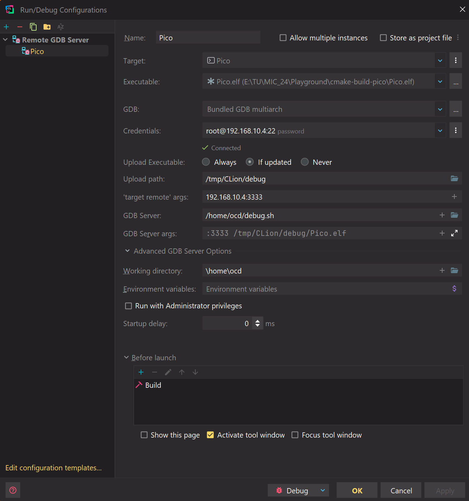

# rpi-pico-remote-gdb
Remote debugging a RPI Pico using a RPI Zero (2) W as OpenOCD host

**Note:** I tested this setup with the "Remote GDB" feature in CLion 2024.2

## Requirements
- Raspberry PI Pico (any variant as of 08/2024)
- Raspberry Pi Zero W or better with ethernet or LAN capabilities
- Computer capable of compiling the code for the Pico

## Setup
1) Install OpenOCD and GDB on the Zero
2) Clone this repository on the Zero and run ```chmod +x debug.sh``` in the directory
3) Connect the Pico's SWD port to the Zero's GPIO:
    - SWDIO to GPIO 24
    - SWDCLK to GPIO 25
    - GND to GND
    - VSYS to +5V
4) Create a new run config in CLion on the computer with the type "Remote GDB"
5) Fill the following fields:
    - **Target:** CMake target to flash
    - **Executable:** Build result (has to be the .elf)
    - **GDB:** Select "Bundled GDB multiarch"
    - **Credentials:** Configure the SSH connection by clicking on the 3-dot-menu on the right side
    - **target remote args:** \<IP of the Zero\>:3333
    - **GDB Server:** select the *debug.sh* script from this repo
    - **Working directory:** select the folder containing the *debug.sh* script

    
6) Click OK and start the run config by clicking on Debug\
The code should be build, uploaded and the debugger connected.

## Copyright and Licenses
*rp2040.cfg* and *raspberrypi-swd.cfg* originate from [https://github.com/raspberrypi/openocd](https://github.com/raspberrypi/openocd). You can find the license in the linked repository.